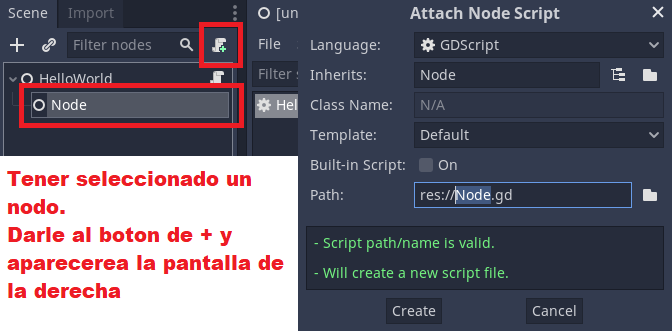
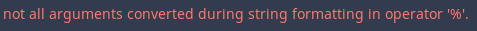
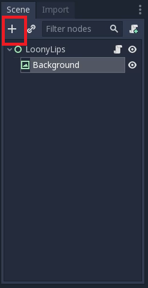
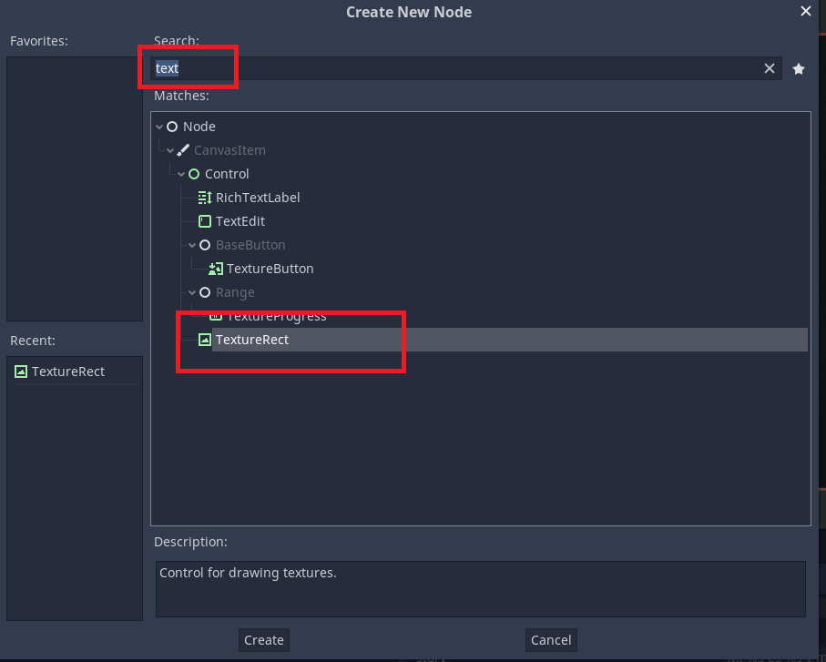
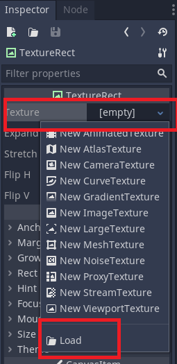

# Godot apuntes

## Tutorial para principiante

Crear un rpg simple

https://godottutorials.pro/rpg-godot-tutorial/

## Udemy

### Capitulo 4

* Los nodos tiene que tener esta estructura --> HelloWorld 

  > Primera letra en mayuscula
  >
  > Sin espacios
  >
  > Cada palabra con la primera letra en mayus

* Crear un nuevo script

  

* Los comentarios en godot se hacen asi.

  > `# Codigo comentado`

* `_ready()` Es la funcion que se ejecuta cuando el nodo se ejecuta en el juego.

* Documentacion de cada metodo/funcion.

  Cuando se quiere sacar por consola algo y se escribe `print()` si se pincha `ctr + click` nos ejecutara la documentacion de godot.

* Variables

  Definir variables `var variable = "Hello"`

  Concatenar variable `variable + "World"`

  Comparar variables `variable == "Hello"`

* Transformar algo en string `str(number)`

### Capitulo 5

* Links utiles:

  [Community gamedev](https://community.gamedev.tv/)

### Capitulo 12

Proyecto que se llama ***Loony Lips***

Recorrer un array y usarlo en medio de un string.

```py
var prompts = ["nombre", "Jesus", "Berisa"]
var story = "Mi %s es %s y mi apellido es %s"
print (story % prompts)

Resultado --> Mi nombre es Jesus y mi apellido es Berisa
```

Si hay mas argumentos que espacios libres en el string, al compilar dará error.

```pyth
var prompts = ["nombre", "Jesus", "Berisa", "pepe"]
var story = "Mi %s es %s y mi apellido es %s"
print (story % prompts)
```



Y lo mismo pasa al contrario, hay definidos mas `%s` de los que hay en el array.

### Capitulo 13

Seguimos con ***Loony Lips***.

* La forma para añadir un background.

  Se pincha en **Add child node.**

  

  Buscamos en el buscador **text** y seleccionamos el **TextureRect**.



En la parte de la derecha



Seleccionamos **texture** y despues **load**, y seleccionamos de assets el background.