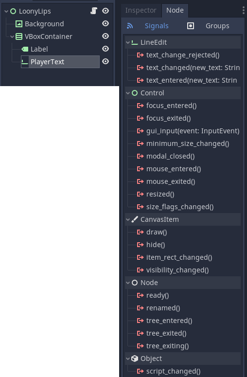

# Godot apuntes

## Tutorial para principiante

Crear un rpg simple

https://godottutorials.pro/rpg-godot-tutorial/

## Websockets ejemplo

https://github.com/gd-com/examples

## Godot mobile

https://docs.godotengine.org/en/3.0/getting_started/step_by_step/your_first_game.html

## Udemy

### Capitulo 4

* Los nodos tiene que tener esta estructura --> HelloWorld 

  > Primera letra en mayuscula
  >
  > Sin espacios
  >
  > Cada palabra con la primera letra en mayus

* Crear un nuevo script

  

* Los comentarios en godot se hacen asi.

  > `# Codigo comentado`

* `_ready()` Es la funcion que se ejecuta cuando el nodo se ejecuta en el juego.

* Documentacion de cada metodo/funcion.

  Cuando se quiere sacar por consola algo y se escribe `print()` si se pincha `ctr + click` nos ejecutara la documentacion de godot.

* Variables

  Definir variables `var variable = "Hello"`

  Concatenar variable `variable + "World"`

  Comparar variables `variable == "Hello"`

* Transformar algo en string `str(number)`

### Capitulo 5

* Links utiles:

  [Community gamedev](https://community.gamedev.tv/)

### Capitulo 12

Proyecto que se llama ***Loony Lips***

Recorrer un array y usarlo en medio de un string.

```py
var prompts = ["nombre", "Jesus", "Berisa"]
var story = "Mi %s es %s y mi apellido es %s"
print (story % prompts)

Resultado --> Mi nombre es Jesus y mi apellido es Berisa
```

Si hay mas argumentos que espacios libres en el string, al compilar dará error.

```pyth
var prompts = ["nombre", "Jesus", "Berisa", "pepe"]
var story = "Mi %s es %s y mi apellido es %s"
print (story % prompts)
```


Y lo mismo pasa al contrario, hay definidos mas `%s` de los que hay en el array.

### Capitulo 13

Seguimos con ***Loony Lips***.

* La forma para añadir un background.

  Se pincha en **Add child node.**

  

  Buscamos en el buscador **text** y seleccionamos el **TextureRect**.


En la parte de la derecha


Seleccionamos **texture** y despues **load**, y seleccionamos de assets el background.

* `get_node('node')` Con esta funcion obtenemos el nod

  Ejemplo: Tengo un nodo que se llama **Label**.

  Pues con `get_node("Label")` estoy obteniendo el nodo **Label** y puedo acceder a sus propiedades, cambiar texto, tamaño etc...

  > Si haces drag (seleccionando el nodo) y drop dentro de get_node() tambien vale

  Forma 2 (Que yo creo que mejor)

  `$Label`

* Para organizar cosas dentro de la pantalla se usan los `HBoxContainer `y el `VBoxContainer`

* Que eventos tienen los nodos?

  

  En la imagen se puede ver que si selecciono el `LineEdit` y en la barra de la derecha selecciono `Node` me aparecen un listado de metodos que tiene el `LineEdit`

### Capitulo 15

* La forma de organizar los objetos dentro del juego son a traves de `VBoxContainer` y de `HBoxContainer`

### Capitulo 16

* Definir la variable como `onready`

  Esto significa que cuando godot ejectue el codigo asignara a una variable algo que aun no existe, y como no existe no dara error.

  Ejemplo:

  ​	Tenemos (por orden) estos objetos:

  ​		-Boton

  ​		-Label

  ​	Si ahora definimos en el codigo fuera de `_ready()` la variable `titulo_boton` sin poner el onready dara error

  ​	`var titulo_boton = $LabelTituloBoton` --> Error porque el label aun no existe

  ​	`onready var titulo_boton = $LabelTituloBoton` --> Ok porque estas asignando el label a una variable pero sin verificar si existe

### Capitulo 17

* `queue_free()` Libera el objeto (por ejemplo un label ) de memoria

* `get_tree()` Obtengo todo el arbol, como `get_node()` pero mejor ya que obtengo el nodo `root` tambien

  > En el video que estoy viendo usa `get_tree().reload_current_scene()` y lo que hara sera recargar el nodo entero

### Capitulo 18

* Diccionario

  > `my_dictionary = {key:value, key:value}`

  A tener en cuenta:

  > ```py
  > var story = "hola"
  > var dictionary = {story:"adios"} 
  > ```
  >
  > Cuidado porque en el diccionario story esta cogiendo el valor definido en la variable, no esta poniendo como key la palabra story


* `randi()`  Baraja de cartas, coje la primera, le doy otra vez y coje la segunda
* `randomize()` Baraja las cartas, coje una, vuelve a barajar y coje otra

### Capitulo 19

* Como tipificar variables

  `var prompts : PoolStringArray` De esta forma se queda definido como Array de Strings

* `get_child_count()` Para saber cuentos hijos tiene un nodo
* `get_child()` Para obtener el hijo del nodo en especifico